### Software que conecta tecnologia, processos e resultados.

Sou **João Lucas Pinheiro**, engenheiro da computação e desenvolvedor de software em **Campo Grande, MS**. Atuo na construção de aplicações backend e full stack, com experiência em APIs, integrações, automação de processos e soluções corporativas.

Meu trabalho envolve transformar necessidades de negócio em sistemas sustentáveis e seguros, do planejamento à entrega. Tenho especial interesse em **inteligência artificial, engenharia de dados, eficiência energética e sustentabilidade**.

---

### Especialidades

| Engenharia de aplicações | Plataformas e integração | Dados e inovação |
| :--- | :--- | :--- |
| Backend e APIs | Arquitetura de sistemas | Inteligência artificial aplicada |
| Full stack | Integrações e automação | Engenharia e análise de dados |
| Qualidade e segurança | Sistemas corporativos | Energia e sustentabilidade |

### Ecossistema tecnológico

**Linguagens e frameworks**

**Dados, serviços e infraestrutura**

`APIs REST` · `Spring Security` · `Mensageria` · `RabbitMQ` · `MinIO` · `CI/CD` · `SQL` · `Arquitetura de software`

---

### Atividade de desenvolvimento

Os valores acima foram fornecidos pelo autor e incluem sua atividade profissional declarada. Não representam métricas auditadas ou confirmadas pela API pública do GitHub. O calendário nativo da plataforma pode apresentar totais diferentes.

### Histórico visível no GitHub

<picture>
  <source media="(prefers-color-scheme: dark)" srcset="https://raw.githubusercontent.com/Joaobueno932/Joaobueno932/output/github-contribution-grid-snake-dark.svg" />
  <source media="(prefers-color-scheme: light)" srcset="https://raw.githubusercontent.com/Joaobueno932/Joaobueno932/output/github-contribution-grid-snake.svg" />
  
</picture>

O histórico animado depende da execução do workflow do GitHub Actions e pode não abranger atividades privadas.

---

Engenharia de software com foco em soluções úteis, confiáveis e preparadas para evoluir.

